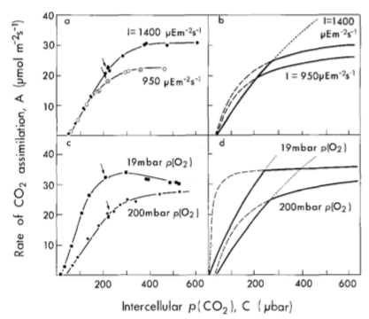
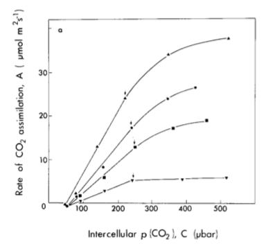
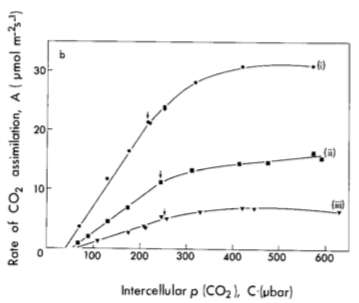

# Reading
Von Caemmerer and Farquhar (1981). Some relationships between the biochemistry
of photosynthesis and the gas exchange of leaves. 
*Planta* **153**: 376-387.

## Discussion
Main points from the paper
- Response of photosynthesis to environmental factors differs at low and high CO2
- Processes limiting photosynthesis differ at low and high CO2
- At low CO2, photosynthesis is limited by Rubisco carboxylation
- At high CO2, photosynthesis is limited by RuP2 regeneration
- Rates of biophysical processes can be extracted from gas exchange data and these match
in vitro measurements
- Long-term response differs from the short-term response

## Let's examine some figures
Figure 1

Figure 2a (Soil nitrogen)

Figure 2b (Light environment)

## So many acronyms! Here are some useful ones to remember:
- RuP2 = Ribulose-1,5-bisphosphate = RuBP
	- Sugar that combines with CO2
- RuP2 carboxylase/oxygenase = Rubisco
	- enzyme that catalyzes the initial Calvin cycle reaction
- Vcmax = maximum rate of Rubisco carboxylation
- J = electron transport rate for regenerating RuP2
- Jmax = maximum rate of J

## In-class points worth mentioning
*(placeholder)